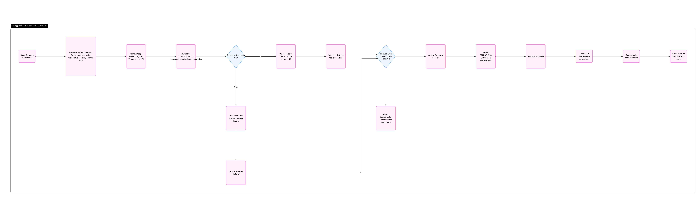

# Bloque 3: Documentación y Buenas Prácticas

## Medir la habilidad de sintetizar requisitos, organizar el trabajo y registrar decisiones para el

## 1. Redacta 3 historias de usuario (formato “Como <rol>..., quiero... para...”),

**Historia de usuario 1 Visualización Inicial de Tareas**

Como un usuario de la aplicación, 
Quiero ver una lista de las primeras 10 tareas al cargar la página,
Para obtener una visión general rápida de las tareas disponibles.

Criterios de Aceptación:

    Escenario 1: Carga exitosa de las tareas
        -Dado que tengo conexión a internet
        -Y accedo a la URL de la aplicación
        -Cuando la página termina de cargar
        -Entonces debo ver una tabla o lista que contenga exactamente 10 ítems.
        -Y cada ítem debe mostrar un "Título" de la tarea.
        -Y cada ítem debe mostrar un "checkbox" que indique si la tarea está "Completada" o no.

**Historia de usuario 2 Filtrado de Tareas por Estado**

Como un usuario,
Quiero poder filtrar las tareas por su estado (completadas, pendientes o todas),
Para encontrar rápidamente las tareas que son relevantes para mí en un momento dado.

Criterios de Aceptación:

    Escenario 1: Filtrar por Tareas Completadas
        -Dado que la lista de tareas está visible
        -Cuando selecciono "Completadas" en el menú desplegable de filtro
        -Entonces solo se deben mostrar en la lista las tareas cuyo checkbox esté marcado.
        -Y las tareas cuyo checkbox no esté marcado deben desaparecer de la vista.

    Escenario 2: Filtrar por Tareas Pendientes
        -Dado que la lista de tareas está visible
        -Cuando selecciono "Pendientes" en el menú desplegable de filtro
        -Entonces solo se deben mostrar en la lista las tareas cuyo checkbox no esté marcado.
        -Y las tareas cuyo checkbox esté marcado deben desaparecer de la vista.

    Escenario 3: Mostrar Todas las Tareas
        -Dado que he aplicado un filtro (Completadas o Pendientes)
        -Cuando selecciono "Todas" en el menú desplegable de filtro
        -Entonces la lista debe volver a mostrar las 10 tareas iniciales, sin importar su estado

**Historia de usuario 3  Notificación de Errores de Conexión**

Como un usuario de la aplicación,
Quiero recibir un mensaje claro si las tareas no se pueden cargar,
Para entender que hay un problema y la información no está disponible.
Criterios de Aceptación:

    Escenario 1: Fallo en la carga de tareas
        -Dado que mi conexión a internet es inestable o la API no está disponible
        -Cuando accedo a la URL de la aplicación
        -Entonces la lista de tareas no debe mostrarse.
        -Y en su lugar, debo ver un mensaje de error amigable, como "Error al cargar las tareas: No se pudieron cargar -las tareas. Por favor, intente de nuevo más tarde."
        -Y no debe aparecer ningún indicador de carga persistente si la operación falló.

## 2. Dibuja un diagrama ligero de flujo de usuario para la función de filtrado. 

## 3. Genera 1 Architecture Decision Record (ADR) donde expliques por qué elegiste
## Vue 3 y JSONPlaceholder 

**Elección de Tecnologías para el Prototipo**
**ADR**

**Elección de Vue 3 (Composition API) y JSONPlaceholder para el Prototipo de ListA de Tareas.**

**Estado: Aceptado Y Contexto**

Se requiere construir un mini-prototipo de "Lista de Tareas" para validar el manejo de Vue 3 (Composition API), consumo de APIs, estado reactivo, componentes y control de errores en un entorno front-end. El objetivo es una validación rápida y efectiva de las habilidades técnicas mencionadas.

**Decisión**
Se ha decidido utilizar Vue 3 con Composition API como framework front-end y JSONPlaceholder como API de datos para el prototipo

**Vue 3**

-Cumplimiento de Requisitos: 
        El enunciado solicita explícitamente validar el manejo de Vue 3 y Composition API, lo que hace que esta elección sea directa y alineada con los objetivos del ejercicio

-Estado Reactivo:
         Vue 3 ofrece un sistema de reactividad robusto y eficiente,    fundamental para una aplicación de lista de tareas donde los datos y la interfaz de usuario deben sincronizarse dinámicamente
         (EJEMPLO  Desarrollo agil ,filtracion de datos y intervas amigable)

-Componentización: 
         Vue 3 fomenta una arquitectura basada en componentes, permitiendo la creación de componentes reutilizables como TaskTable, lo que mejora la modularidad y la claridad del código.

**JSONPlaceholder**

-Disponibilidad y Estabilidad:
         Es una API muy conocida y estable, lo que reduce el riesgo de interrupciones o problemas de conectividad durante el desarrollo del prototipo.

-Simplicidad:
          Ofrece endpoints sencillos y datos estructurados en formato JSON, lo que facilita su consumo con Workspace o librerías HTTP, permitiendo enfocarse en la lógica del front-end en lugar de en la complejidad de una API real
-Cumplimiento de Requisitos:
         Proporciona el endpoint /todos necesario para cumplir con el requisito  de consumir [JSONPlaceholder] (https://jsonplaceholder.typicode.com/todos)

